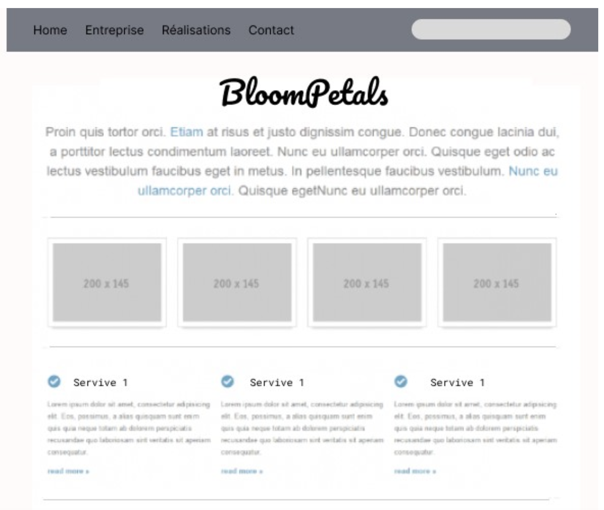
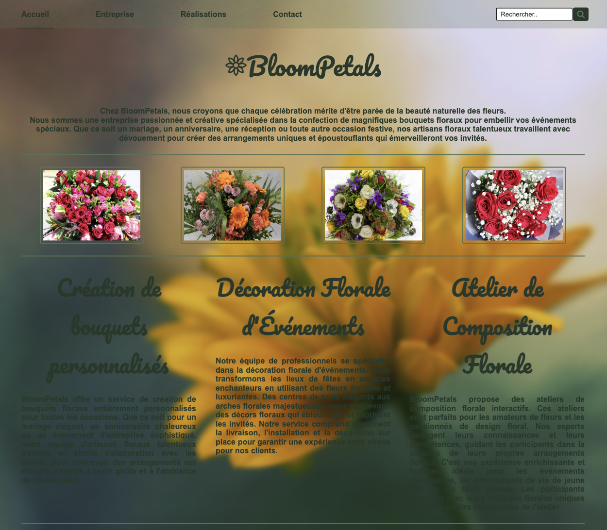

 # 🌸 BloomPetals
 HTML and CSS project for school 

 ## 📝 Instructions
BloomPetals is a passionate and creative company specializing in the
design of beautiful floral bouquets to embellish your
special events. Whether it is a wedding, a birthday, a reception or any
other festive occasion.
The marketing team of the BloomPetals brand knows the importance of
being present on the web, it needs you to create web pages for it, thanks
to your newly acquired knowledge. It has provided you with a model for the home page.

### <u>Model given :</u>

### <u>Preview :</u>

